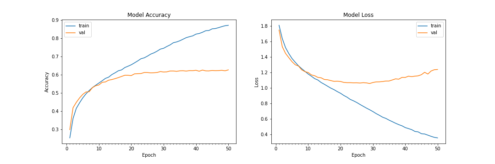
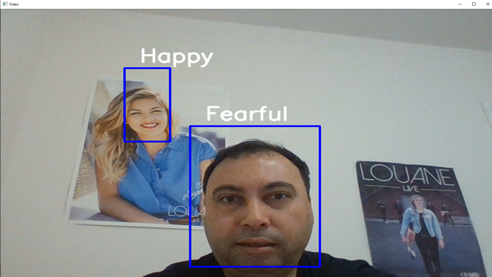

# Détection des émotions en temps réel à l'aide du deep learning.

## Introduction

Ce projet vise à classer l'émotion sur le visage d'une personne dans l'une des "sept catégories", en utilisant des réseaux de neurones convolutifs profonds. Le modèle est formé sur l'ensemble de données. Cet ensemble de données se compose de 28716 images de visage en niveaux de gris et de taille 48x48 avec "sept émotions" - en colère, dégoûté, craintif, heureux, neutre, triste et surpris.

## Dépendances:

* Pour installer les packages requis, exécutez:
pip installer numpy
pip installer des pandas
pip installer tensorflow
pip installer keras
pip installer opencv-python

* Python 3, [OpenCV](https://opencv.org/), [Tensorflow](https://www.tensorflow.org/)


## Utilisation de base:

* Pour cloner le projet sur votre ordinateur à partir d'un terminal:
```bash
git clone https://github.com/atulapra/Emotion-detection.git
cd mon_dossier
```

Le projet est compatible avec `tensorflow-2.0` et utilise l'API Keras en utilisant la bibliothèque` tensorflow.keras`.

*Pour télécharger le model pré-entrainé 'model.h5' suivez ce lien:
https://drive.google.com/file/d/1HafN_24_J81g_F1aEC_IifvRXDyl2vvp/view?usp=sharing


* Cette implémentation détecte par défaut les émotions sur tous les visages dans le flux de la webcam. Avec un CNN à 4 couches, la précision du test a atteint 63,2% en 50 époques.




## Algorithme

* Tout d'abord, la méthode "haar cascade" est utilisée pour détecter les visages dans chaque image du flux webcam.

* La région de l'image contenant le visage est redimensionnée en "48x48" et transmise en entrée au CNN.

* Le réseau produit une liste de "scores softmax" pour les sept classes d'émotions.

* L'émotion avec le score maximum est affichée à l'écran.

## Exemple de sortie




